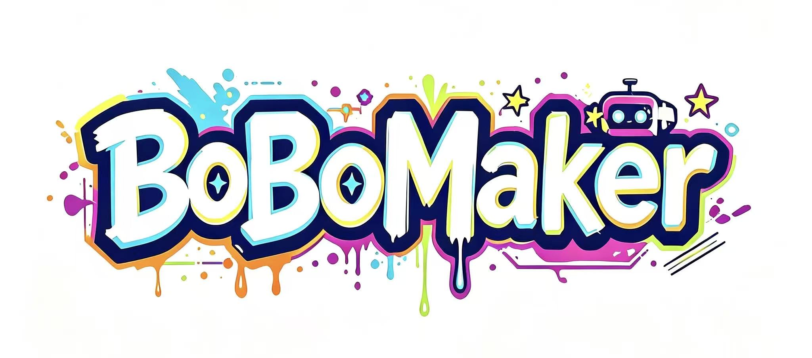

<p align="center">
  
</p>

<h1 align="center">MicroDuck BoBoRedesign</h1>

<p align="center">
  <a href="README_CN.md">中文文档</a> |
  <a href="http://opc.bobomaker.com">BoBoMaker Official</a> |
  <a href="https://github.com/pollen-robotics/microduck">Original Project</a>
</p>

<p align="center">
  <strong>A 3D-printable, community-driven redesign of the MicroDuck bipedal robot</strong>
</p>

---

## Overview

**MicroDuck BoBoRedesign** is an open-source community project that reimagines the [MicroDuck](https://github.com/pollen-robotics/microduck) — a tiny bipedal robot powered by reinforcement learning — for the **3D printing community**.

The original MicroDuck, developed by [Pollen Robotics](https://pollen-robotics.com/microduck), uses injection-molded parts that are not ideal for 3D printing reproduction. This project takes on the challenge of **redesigning every component for FDM/SLA 3D printing**, while preserving the original appearance and enhancing structural integrity for printed replicas.

> **Our Mission:** To make the MicroDuck accessible to every maker, hobbyist, and researcher who owns a 3D printer — no injection molding required.

## Project Goals

- **Faithful Reproduction** — Recreate the MicroDuck shell, PCB, firmware, and RL policies as closely as possible to the official version
- **3D Print Optimization** — Redesign all shell parts with print-friendly geometry, proper tolerances, and aesthetic enhancements tailored for additive manufacturing
- **Structural Reinforcement** — Strengthen key load-bearing components to improve durability and reliability of 3D-printed versions
- **Domestic Servo Support** — Gradually expand compatibility with affordable, widely-available domestic servo motors as alternatives to the original Dynamixel servos
- **Community Driven** — Open to contributions from the global maker community

## Project Structure

```
MicroDuck-BoBoRedesign/
├── 01-3DPrint/    # 3D-printable shell models (STL/STEP files, print profiles)
├── 02-PCB/        # Custom PCB designs and schematics
├── 03-Code/       # Firmware and control code
├── 04-RL/         # Reinforcement learning training and policy files
├── assets/        # Project assets (logo, images, etc.)
└── README.md
```

### Folder Details

| Folder | Contents |
|--------|----------|
| `01-3DPrint` | Redesigned 3D models optimized for FDM/SLA printing, including assembly guides and recommended print settings |
| `02-PCB` | PCB layouts, schematics, and BOM (Bill of Materials) for the custom control board |
| `03-Code` | Firmware source code, configuration files, and deployment scripts |
| `04-RL` | RL training environments, policy configurations, and ONNX model exports |

## Getting Started

> **Note:** This project is currently in active development. Detailed build instructions, BOM lists, and print profiles will be added as each module matures.

### Prerequisites

- A 3D printer (FDM or SLA)
- Basic electronics assembly skills
- Familiarity with servo motor calibration
- (Optional) Experience with reinforcement learning for custom policy training

### Build Order

1. **3D Print** the shell components from `01-3DPrint/`
2. **Assemble** the PCB from `02-PCB/`
3. **Flash** the firmware from `03-Code/`
4. **Train & Deploy** RL policies from `04-RL/` (or use pre-trained models)

## Acknowledgments

This project is a **secondary development** based on the original [MicroDuck](https://github.com/pollen-robotics/microduck) project by [Pollen Robotics](https://pollen-robotics.com/). We deeply appreciate their pioneering work in open-source robotics.

- **Original Project:** [pollen-robotics/microduck](https://github.com/pollen-robotics/microduck)
- **RL Training Repo:** [pollen-robotics/microduck_rl](https://github.com/pollen-robotics/microduck_rl)

## License

This project follows the licensing terms of the original MicroDuck project:

- **Code & Firmware:** Apache License 2.0
- **3D Models & Designs:** Creative Commons Attribution-ShareAlike-NonCommercial (CC BY-SA-NC)

Please refer to the original project's [LICENSE](https://github.com/pollen-robotics/microduck/blob/main/LICENSE) file for full terms. All derivative works in this repository are subject to the same conditions.

## Contributing

Contributions are welcome! Whether you're improving print profiles, optimizing PCB layouts, writing firmware, or training new RL policies — every contribution counts.

1. Fork the repository
2. Create your feature branch (`git checkout -b feature/YourFeature`)
3. Commit your changes (`git commit -m 'Add YourFeature'`)
4. Push to the branch (`git push origin feature/YourFeature`)
5. Open a Pull Request

## Community

Join the conversation, share your builds, and connect with fellow makers:

- **Issues:** Report bugs or request features via [GitHub Issues](https://github.com/your-username/MicroDuck-BoBoRedesign/issues)
- **Discussions:** Share your build progress and ideas in [GitHub Discussions](https://github.com/your-username/MicroDuck-BoBoRedesign/discussions)

---

<p align="center">
  Made with passion by the <a href="http://opc.bobomaker.com">BoBoMaker</a> community
</p>
